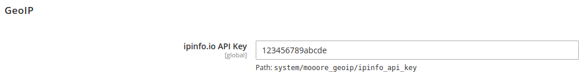

# Magento 2 GeoIp
Magento 2 module providing basic Geo IP detection.

## API

### REST
```
$ curl https://<<magento site>>/rest/V1/countryCode
"NL"                                                                                                                                                                                                                        
```

### PHP
``` php
<?php

namespace Acme\Component;

use Mooore\GeoIp\Api\CountryCodeInterface;

class SomeComponent
{
    /**
     * @var \Mooore\GeoIp\Api\CountryCodeInterface
     */
    private $countryCode;

    public function __construct(CountryCodeInterface $countryCode)
    {
        $this->countryCode = $countryCode;
    }

    public function execute(): void
    {
        //output: Country is NL
        echo sprintf('Country is %s', $this->countryCode->get());
    }
}
```

## Installation
```shell script
composer require marissen/magento2-module-geoip
bin/magento setup:upgrade
```

## Configuration
This module has a fallback reliance on several inputs:
1. [GeoIP](http://nginx.org/en/docs/http/ngx_http_geoip_module.html) variable `GEOIP_COUNTRY_CODE`.
2. [GeoIP2](https://github.com/leev/ngx_http_geoip2_module) variable `COUNTRY_CODE`.
3. [Cloudflare](https://www.cloudflare.com/) header `CF-IPCountry`.
4. [IpInfo.io](https://ipinfo.io/) API.

To be able to fall back on IpInfo.io, follow these steps:
1. Have an account at [ipinfo.io](https://ipinfo.io/).
2. Have the ipinfo.io API key.
3. Configure it in the Magento 2 backend (Advanced -> System -> GeoIP):

